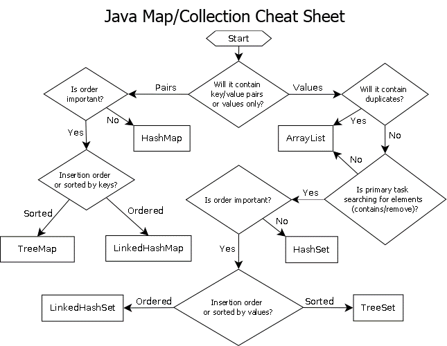

# Collections: Set, List, Map





## iterator

```{java}
public static void main(String[] args)
{
    Set<String> set = new HashSet<String>();
    set.add("Rain");
    set.add("In");
    set.add("Spain");

     // Get an iterator for the set
     Iterator<String> iterator = set.iterator();

    while (iterator.hasNext())        // Check if there is another element
    {
       // Get the current element and move to the next one
       String text = iterator.next();

        System.out.println(text);
    }
}
```


## display elements of a map

```{java}
public static void main(String[] args)
{
    // All elements are stored in pairs
    Map<String, String> map = new HashMap<String, String>();
    map.put("first", "Rain");
    map.put("second", "In");
    map.put("third", "Spain");

    Iterator<Map.Entry<String, String>> iterator = map.entrySet().iterator();

   while (iterator.hasNext())
    {
        // Get a key-value pair
        Map.Entry<String, String> pair = iterator.next();
        String key = pair.getKey();            // Key
        String value = pair.getValue();        // Value
        System.out.println(key + ":" + value);
    }
}
```

or

```{java}
public static void main(String[] args)
{
    Map<String, String> map = new HashMap<String, String>();
    map.put("first", "Rain");
    map.put("second", "In");
    map.put("third", "Spain");

    for (Map.Entry<String, String> pair : map.entrySet())
    {
        String key = pair.getKey();                      // Key
        String value = pair.getValue();                  // Value
        System.out.println(key + ":" + value);
    }
}
```


\1. Create **a list of numbers**.
\2. Use the keyboard to add **10 numbers** to the list.
\3. Display the length of the longest sequence of repeating numbers in the list.

**Example for the list** **2**, **4**, **4**, **4**, **8**, **8**, **4**, **12**, **12**, **14**:

output: 3


```{java}
package com.codegym.task.task08.task0812;

import java.io.*;
import java.util.ArrayList;

/* 
Longest sequence

*/
public class Solution {
    public static void main(String[] args) throws IOException {
        //write your code here
        BufferedReader reader = new BufferedReader(new InputStreamReader(System.in));
        ArrayList<Integer> list = new ArrayList<>();
        for(int i = 0; i < 10; ++i) {
            int num = Integer.parseInt(reader.readLine());
            list.add(num);
        }
        int count = 1;
        int res = 1;
        for(int i = 0; i < list.size()-1; i++) {
            if(list.get(i).equals(list.get(i+1)) ) {// Integer object use .eqauls()
                count++;
                res = Math.max(res, count);
            }
            else count = 1;
            
        }
        System.out.println(res);
    }
}
```

### List

| Operations | Method |
| ---------- | ------ |
| add()      |        |
| get()      |        |
| remove()   |        |

### Stack

peek()

pop()

push()

empty()


### Queue

offer()

poll()

remove()

peek()

element()


## Set

| Operation                            | Method                    |
| ------------------------------------ | ------------------------- |
| Add element(s)                       | add(), addAll()           |
| Remove element(s)                    | remove(), removeAll()     |
| Check for the presence of element(s) | contains(), containsAll() |


## Map

| Operation                                    | Method               |
| -------------------------------------------- | -------------------- |
| Get a set of all pairs                       | entrySet()           |
| Get a set of all keys                        | keySet()             |
| Get a set of all values                      | values()             |
| Add a pair                                   | put(key, value)      |
| Get the value for the specified key          | get(key)             |
| Check whether the specified key is present   | containsKey(key)     |
| Check whether the specified value is present | containsValue(value) |
| Check whether the Map is empty               | isEmpty()            |
| Clear the Map                                | clear()              |
| Remove the value for the specified key       | remove(key)          |


Create a **Map**<String, Integer> and add ten entries that represent (***last name***, ***salary***) pairs.
Remove from the map all people whose salary is below **500**.

use iterator

```{java}
package com.codegym.task.task08.task0818;

import java.util.HashMap;
import java.util.Map;
import java.util.Iterator;

/* 
Only for the rich

*/

public class Solution {
    public static HashMap<String, Integer> createMap() {
        //write your code here
        HashMap<String, Integer> map = new HashMap<>();
        map.put("s1", 1000);
        map.put("s2", 100);
        map.put("s3", 10010);
        map.put("s4", 103300);
        map.put("s5", 400);
        map.put("s6", 11000);
        map.put("s7", 10001);
        map.put("s8", 100110);
        map.put("s9", 101001);
        map.put("s10", 1110010);
        return map;
    }

    public static void removeItemFromMap(HashMap<String, Integer> map) {
        //write your code here
        Iterator <Map.Entry<String, Integer>> ite = map.entrySet().iterator();
        while(ite.hasNext()) {
            int value = ite.next().getValue();
            if(value < 500)
                ite.remove();
        }
        
    }

    public static void main(String[] args) {

    }
}
```


