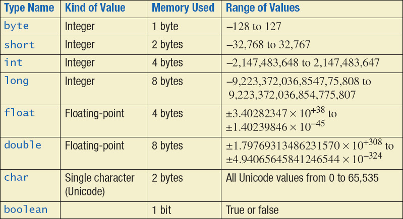
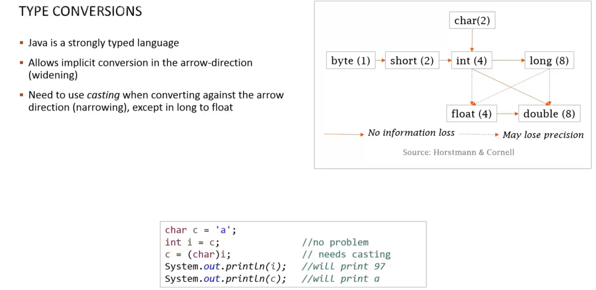

# DataType

* Primitive Type
  * Numeric Type
    * Floating
    * Integral
  * boolean
  * returnAddress (JVM)
  
* Reference Type (Object Type)
  * Reference
    * Class
    * Interface
    * Array
  
* Wrapper Class

  * Boolean

  * Short

  * Byte

  * Char

  * Integer

  * Float

  * Long

  * Double

    




## Type Conversion




## Boxing and Unboxing

```{java}
Integer wrapperX = new Integer(5);
Integer wrapperY = 10; //auto-boxing
Integer wrapperZ = wrapperX + wrapperY; //auto-unboxing and then auto-boxing
```


## String Data Type


String pool

```{java}
String s3 = "Hello";
String s4 = "Hello";
s3 == s4; // true
s3 += " World";
s3 == s4; //false
```

