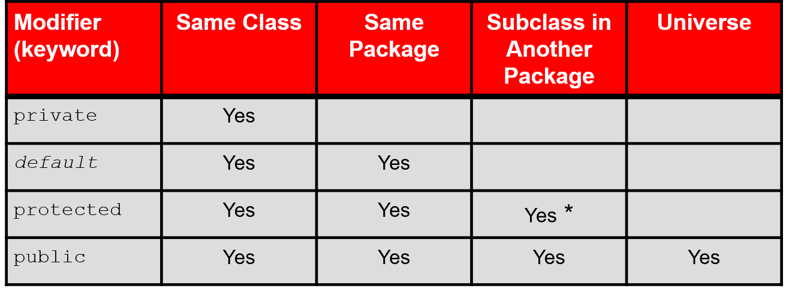

# Encapsulation,Inheritance&Polymorphism

### Variable Arguments

```{java}
public class Statistics {
     public float average(int... nums) { // the vararg notation treats the nums parameter as an array
         int sum = 0;
         for (int x : nums) {  // iterate int array nums
             sum += x;
         }
         return ((float) sum / nums.length);
     }
 }

```

### Access Control




### Inheritance

### problem with constructors

•Once we write a constructor (that requires parameters) in the superclass, we must now write constructors for our employee subclasses as well.


superclass

subclass

public class **name** extends **superclass** {}

super.methodName()

subclass receives default constructor

```{java}
public Lawyer() {
    super();         // calls Employee() constructor
}

```

Private fields cannot be directly accessed from subclasses.


### calling overridden methods

super.method(parameters)


```{java}
public class Lawyer extends Employee {
	    public Lawyer(int years) {
	        super(years);  // calls Employee constructor
	    }
	    ...
	}

```


Private
fields cannot be directly accessed from subclasses.

解决方法 在父类中添加获取private变量值的函数


When a method is a subclass **overrides** a method in the parent class, it must provide the same or greater access than the parent class. For example, if the parent method getDetails() on the slide was protected, then the overriding method getDetails() in the subclass must be protected or public.