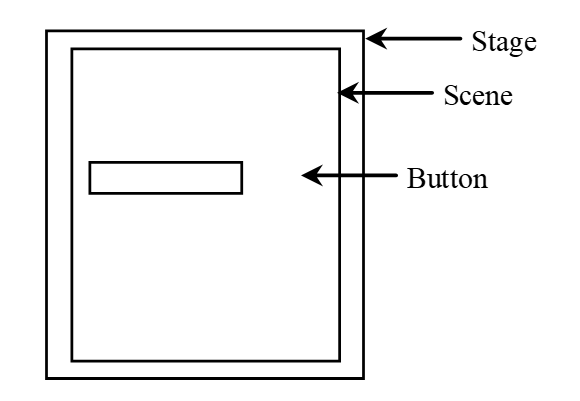

# GUI&Lambda



## Lambda Expression

Syntax:

  (***parameters*** ) -> ***expression*** 

```
List<Integer> list = Arrays.asList(1, 4, 2, 6, 2, 8);
list.sort(Comparator.reverseOrder());
System.out.println(list);
```

