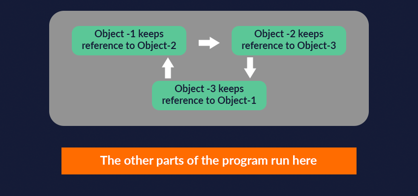
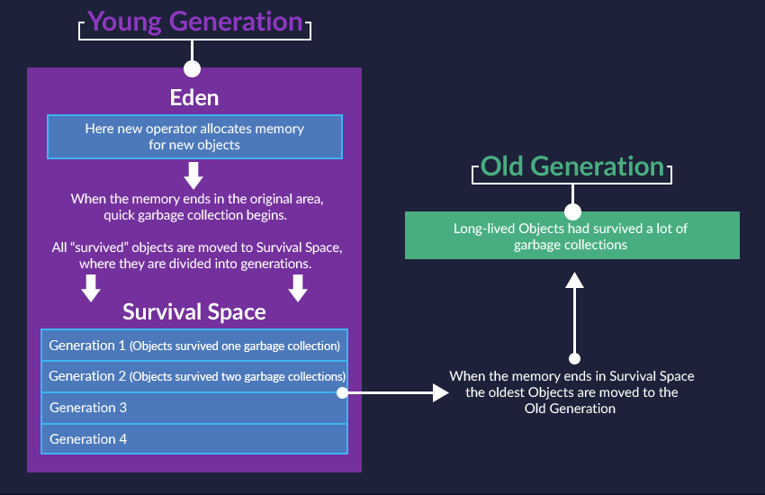

# Garbage Collection

When the garbage collector reaches an object—just before it is destroyed—the object's special `finalize()` method is called.

But it is not always called before an object is destroyed.

*  The garbage collector works in parallel with your program. It runs ``separatley``.
* Garbage collection used to be performed ``on the same thread`` as your program. This mechanism was later changed, and now the garbage collector runs in the background, not impeding the work of the program itself.

The figure shows an example where 3 objects **refer to each other**, but no one else refers to them. In other words, the rest of the program doesn't need them. If the garbage collector simply counted references, these 3 objects would not be collected and the memory would not be freed (there are references to them!).

Accordingly, in Java, the decision was made to collect garbage based not on reference counting, but on a separation of objects into two types: **reachable** and **unreachable**.

## Memory Arrangement

All Java objects are stored in the heap. It was divided into several parts. <https://codegym.cc/groups/posts/16-more-about-the-garbage-collector->

Together, eden and a survival space form an area called the **young generation**.

* The first part is called **eden**. This is the part of memory where new objects are created when we use the keyword **new**. When this area runs out of space, an initial "fast" garbage collection begins.
*  An area of memory where all objects that have survived at least one round of garbage collection are moved is called **a survival space**. It is divided into generations. If an object has survived one round of garbage collection, then it is in "Generation 1"; if 5, then "Generation 5".

In addition to the young generation, the heap has another area of memory called the **old generation**. This is precisely the area where long-lived objects that have survived many rounds of garbage collection end up.

* Full garbage collection is performed only when the old generation is full.

