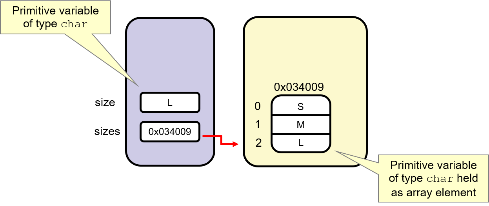
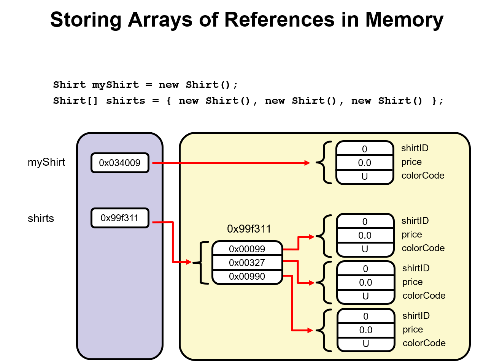

# Overloading, Static, Arrays

## final

1、被final修饰的类不可以被继承；
2、被final修饰的方法不可以被重写；
3、被final修饰的变量不可以被再次赋值。

## this

```{java}

public class Shirt {
  char colorCode;
  double price; 
  
  // No-argument constructor
  public Shirt() {
     // You could add some default processing here
  }
// This constructor takes one argument
  public Shirt(char colorCode ) {
      setColorCode(colorCode);
  }
  // This constructor takes 2 arguments
public Shirt(char colorCode, double price) {
       this(colorCode);
       this.price = price;
  }
}
```

this();带上参数列表的方式可以访问其他构造函数
比如 this（“jisi”）访问带一个字符串参数的构造函数

chaining constructor

this(para)

## static

The static modifier is used to declare fields and methods as **class-level** resources. 

We can invoke class method or static method without creating an object first.

### static method

•**Cannot access non-static members within the same class**

•Can be hidden in subclasses but **not overridden**

### static variables

•Called class variables

•Useful for containing shared data

​	-Static methods store data in static variables.

​	-All object instances share a single copy of any static variables.

•Initialized when the containing class is first loaded


Note that variables can have both the static and final modifier to indicate that there is only one copy of the variable and that the contents of the variable cannot be changed. The **PI** variable in the Math class is a static final variable.


## arrays



Arrays are objects referred to by an object reference variable. The diagram in the slide illustrates how a primitive array is stored in memory in comparison to how a primitive data type is stored in memory.



### ArrayList

add() get() remove() indexOf().

An ArrayList can store only **objects**, not primitives.