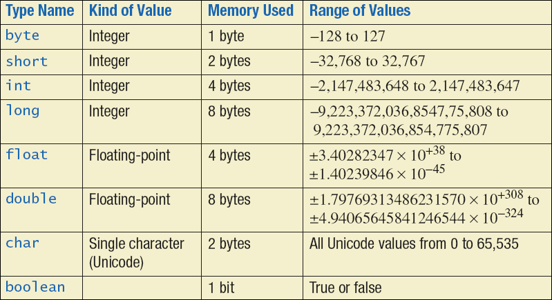

# Program Control

## Primitive Type



boolean 1 bit

char 2 bytes


## Constants

final int VARIABLE


## Stack and Heap

Objects and their fields and methods are usually stored in **heap memory**. Heap memory
consists of dynamically allocated memory chunks containing information used to hold objects.

Local variable declared **inside a method** is stored in stack memory for only a brief of time


## Type Casting

identifier  = (target type) value

num3 = (byte) num1 + num2


## Compiler Assumptions for Integral and Floating Point Data Types

精度小于int的数值运算的时候都回被自动转换为int后进行计算 (byte char short)

有一个参数是long型 其他数promoted to long, the result is also long type.

```{java}
short a, b, c;
a = 1 ;	
b = 2 ;
c = a + b ; //compiler error

```

**c = (short)(a+b);**

在java中浮点型默认是double的

```{}
float float1 = 27.9;	//compiler error

Example of potential solutions:
The F notifies the compiler that 27.9 is a float value:

	float float1 = 27.9F;

27.9 is cast to a float type:
	float float1 = (float) 27.9;
```


## Switch Construct

```{java}
switch(expression){
    case value :
       //语句
       break; //可选
    case value :
       //语句
       break; //可选
    //你可以有任意数量的case语句
    default : //可选
       //语句
}
```


## String class

```{java}
String hisName = "Fred Smith";
```

hisName 地址在stack 内容在heap

```
public String substring(int beginIndex)

或

public String substring(int beginIndex, int endIndex)
```

参数

- **beginIndex** -- 起始索引（包括）, 索引从 0 开始。
- **endIndex** -- 结束索引（不包括）。

### StringBuilder Class

a mutable alternative to String

```{java}
StringBuilder myString = new StringBuilder("hello");
myString.append(" world");
```


Only local variables inside a method need to be initialized before use;

```{java}
public class Hello {
    static boolean b1;
    public static void main(String[] args) {    
        boolean b2 = !b1;
        System.out.println(b2); // print true
    }
}
```


## Switch

 switch表达式的取值：byte,short,int,char
                                    JDK5以后可以是枚举
                                    JDK7以后可以是String 

如下代码， case“A” ：之后没有break，此刻会继续执行 case “B”：的代码 System.out.println("bbbbbbbb");遇到break之后，代码运行结束。
