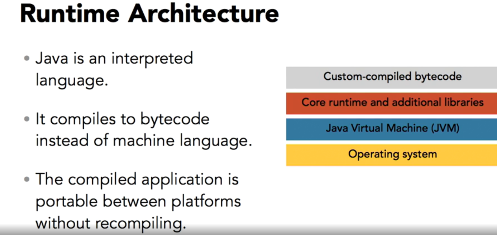
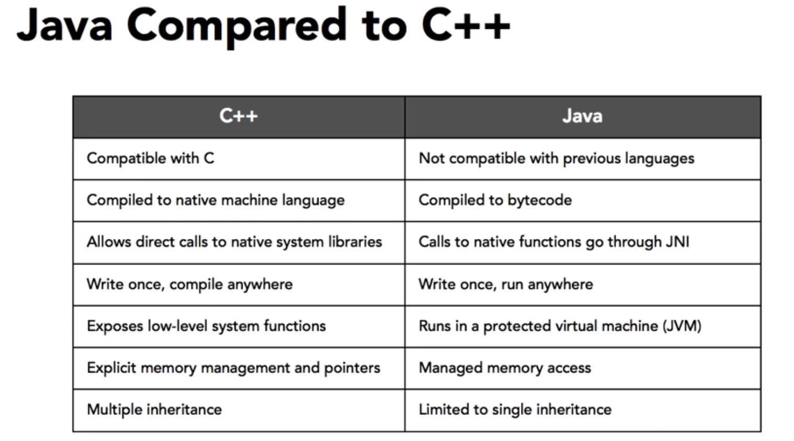
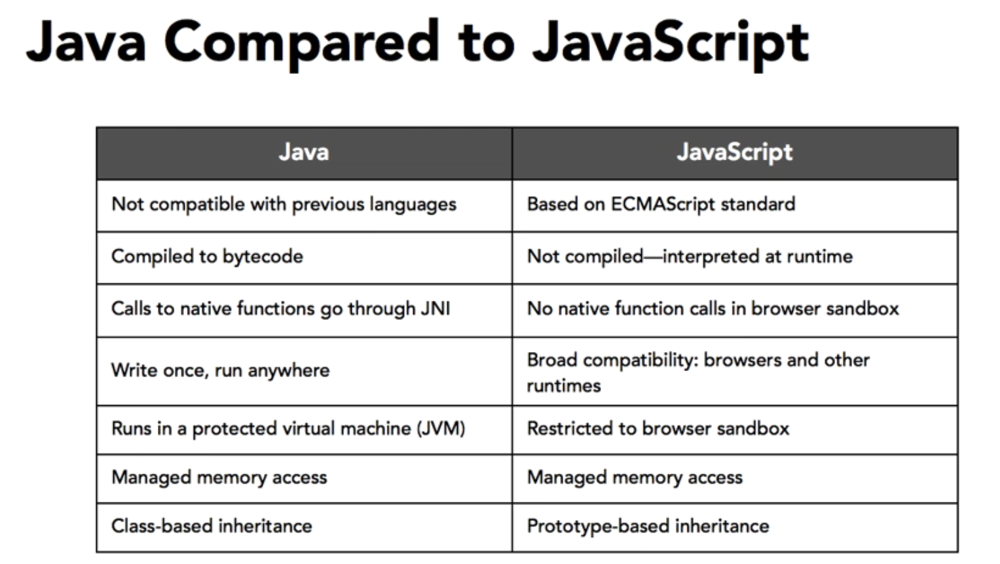

# Introduction

started in 1991  called Oak

a new portable language

tagline: Write once, Run everywhere

interpreted  interpreted at runtime

### JDK JRE

javadocs JDK

java: compiler JDK

JVM JRE

Runtime Libraries JRE

javac Hello.java

java Hello